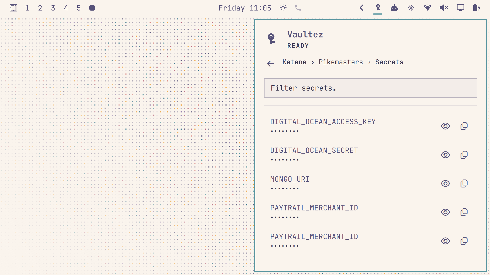

# Vaultez for Omarchy

Get your [Vaultez](https://vaultez.app) secrets from the Omarchy menu bar, sorted
by company and project.



## Installation

You'll need the `vaultez-cli` gem installed, at exactly the version this
plugin was reviewed against. This plugin hands that CLI your saved session
and every secret it returns, so the install is pinned to that one version
rather than a range — even a same-series patch release is unreviewed until
a plugin update deliberately adopts it:

```bash
gem install vaultez-cli --version '0.3.0'
```

The plugin also checks the *installed* CLI's actual version at runtime
(`vaultez --version`, not just that some binary exists on `$PATH`), so an
old install already present (from before this plugin, e.g. the 0.2.x series
with the config-permissions bug and the `--token` flag exposure), or any
version newer than what's pinned above, is not silently trusted with your
session and secrets — you'll see an "Update" prompt instead.

Then add it as a plugin:

```bash
omarchy plugin add https://github.com/nursahketene/oma-vaultez.git --enable
```

## Removal

```bash
omarchy plugin remove app.vaultez
```

This disables the plugin and removes it from `~/.config/omarchy/plugins/`
(a timestamped backup is kept alongside the other plugin directories). To
also remove the CLI: `gem uninstall vaultez-cli`.

## Usage

Click the key icon in the bar.

- **Not logged in?** Click "Log In" — this opens a terminal running `vaultez login`
  (email, password, and your TOTP code, same as running it yourself). Reopen the
  panel once you're done. Don't have an account yet? There's a link to sign up at
  vaultez.app right below the button.
- **CLI not found?** Click "Install" — opens a terminal running
  `gem install vaultez-cli --version '0.3.0'`.
- **CLI installed but on an untrusted version?** Click "Update" — runs the
  same install command, which moves the existing gem (older or newer) to
  exactly the pinned version in place.
- Click a company, then a project, to see its secrets. Secret values are masked by
  default — click a secret to reveal it, or use the copy button to copy the value to
  your clipboard without revealing it on screen.
- Type in the filter box at any level to narrow the list.

## Settings

If `vaultez` isn't on your `$PATH` (for example, installed under a Ruby version
manager like `rbenv`, `rvm`, or `mise`), open the plugin's settings and set
"Path to vaultez binary" to wherever `gem install` actually put it — `which vaultez`
after installing will tell you.

## How it works

The plugin shells out to `vaultez fetch ... --json` for data and reuses whatever
session `vaultez login` already created (`~/.vaultez/config.yml`) — there's no
separate login state to manage. Every secret fetch is still logged as an activity in
the Vaultez web UI, same as using the CLI directly.

## License

MIT
